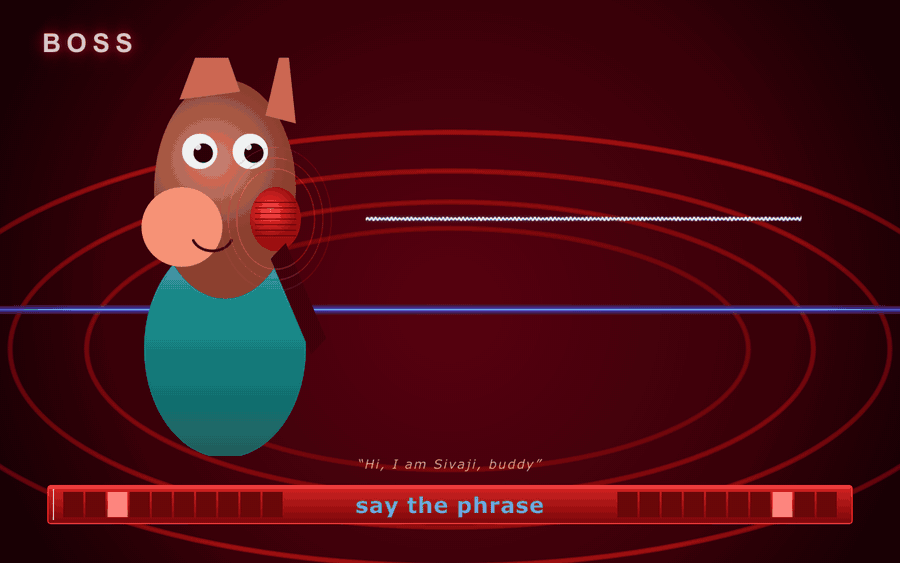
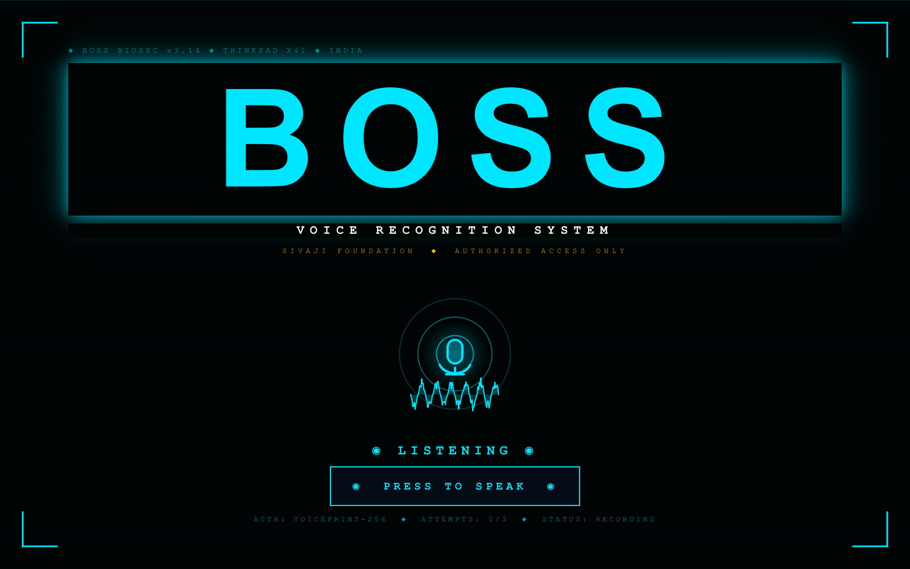
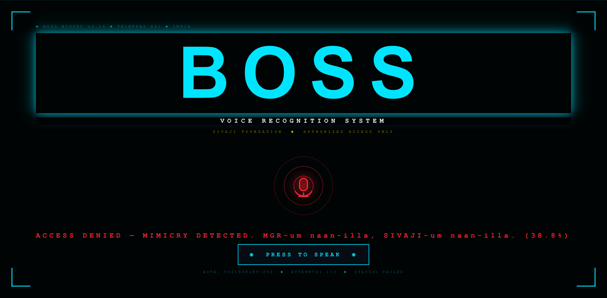
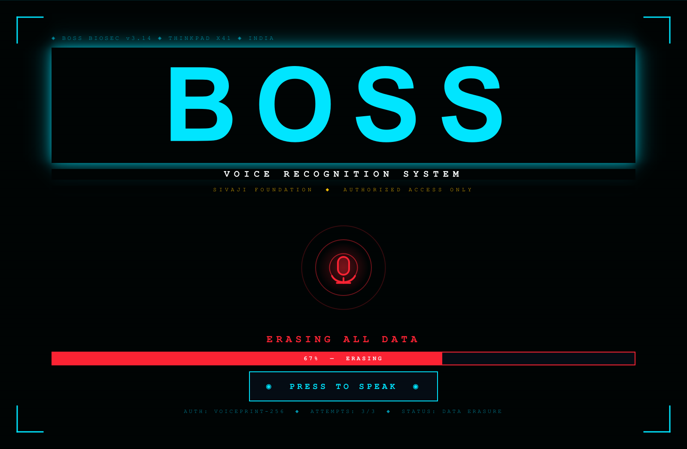
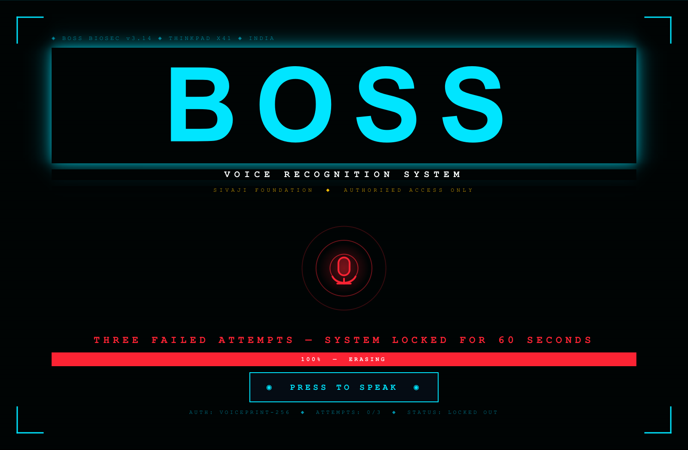

<div align="center">

# 🎬 Rajini-Lock

### A voice-authenticated lock screen for macOS, recreated shot-for-shot from **Sivaji: The Boss (2007)**

> *"Hi, I'm Sivaji buddy, cool!"*
>
> — Rajinikanth, getting into his laptop the way nature intended

[](https://www.apple.com/macos/)
[](https://www.python.org/)
[](LICENSE)
[](CONTRIBUTING.md)



</div>

---

## What is this

Remember the scene where Rajinikanth opens his laptop and it asks for his **voice** — and when the CBI tries to mimic him, it **wipes itself clean**?

This is that. On your Mac. Actually working.

- 🎙️ **Speaker-only voice recognition** — any words in *your* voice unlocks it. Not even Rajini-level mimicry artists can fake your voiceprint.
- 🔒 **Auto-launches at login** — your Mac boots straight into the BOSS screen.
- 💥 **3 failed attempts → dramatic data-erase animation** (visual only, nothing actually deleted — chill, fam).
- 🆘 **Built-in kill-switch** — never fear getting locked out of your own machine.
- 🇮🇳 **100% film-faithful UI** — electric-blue CRT phosphor, BOSS branding, corner brackets, scanlines, radar mic.

---

## 📸 Screenshots

| Idle | Listening | Access Granted |
|:---:|:---:|:---:|
|  |  |  |

| Access Denied | Data Erasure | Locked Out |
|:---:|:---:|:---:|
|  |  |  |

---

## 🚀 Install

**Requirements:** macOS 13+ (tested on Tahoe 26.2 / Apple Silicon), Python 3.10+, a microphone.

```bash
# 1. Clone
git clone https://github.com/harshadmahajan63/rajini-lock.git
cd rajini-lock

# 2. Install
bash scripts/install.sh

# 3. Enroll your voice (records 5 short phrases, ~30 seconds total)
~/Library/Application\ Support/RajiniLock/app/venv/bin/rajini-enroll
```

That's it. Log out, log back in — you'll boot into the BOSS screen. Hit **PRESS TO SPEAK**, say literally anything in your voice, and you're in.

> 💡 **First time?** Run `rajini-enroll` from Terminal **before** the lock takes over your login. Otherwise the lock will refuse to load (no voiceprint, no boss).

---

## 🎤 How the voice matching works

We use [**Resemblyzer**](https://github.com/resemble-ai/Resemblyzer) — a 256-dimensional speaker embedding from a pre-trained GE2E neural network. Same family of model used in production speaker-ID systems.

1. **Enrollment:** record 5 short clips, average their embeddings → your *voiceprint*
2. **Unlock:** record 4s of audio → embed → cosine-similarity vs voiceprint
3. **Match if ≥ 0.75** (configurable in `sivaji_unlocker/config.py`)

This is **speaker verification, not speech recognition** — the words don't matter, only your voice does. So:

- ✅ "Hi I'm Sivaji buddy cool" → unlocks
- ✅ "Pizza Friday" → unlocks (it's still you)
- ❌ Friend doing their best Rajini impression → denied
- ❌ A clip of you played from someone else's iPhone speaker → usually denied (the encoder is sensitive to channel artifacts, but it's not anti-spoof — see [Limitations](#-limitations))

---

## 🆘 Emergency exits (please read)

Things break. Mics fail. Voices change. You will eventually need one of these:

### From inside the running lock screen

There's no escape key — by design. But these macOS-level shortcuts still work:

- `⌃⌥⌘⏏` (Control-Option-Cmd-Eject) → restart
- Hold power button 5s → hard shutdown

### From another logged-in Terminal / SSH

```bash
touch ~/.rajini_disable     # skips lock at next login
killall Python              # closes the current lock window
```

### From Recovery Mode (the nuclear option)

1. Shut down → hold power until "Loading startup options" appears
2. **Options → Continue → Utilities → Terminal**
3. Run:
   ```bash
   touch /Users/$(whoami)/.rajini_disable
   ```
4. Reboot.

Full guide: [`scripts/recovery.md`](scripts/recovery.md).

### Uninstall completely

```bash
bash scripts/uninstall.sh
```

---

## ⚙️ Configuration

Edit `~/Library/Application Support/RajiniLock/app/sivaji_unlocker/config.py`:

| Setting | Default | What it does |
|---|---|---|
| `SIMILARITY_THRESHOLD` | `0.75` | Cosine sim required to unlock. Lower = more permissive. |
| `RECORD_SECONDS` | `4` | How long each unlock attempt records. |
| `ENROLL_SAMPLES` | `5` | How many phrases recorded during enrollment. |
| `MAX_ATTEMPTS` | `3` | Failed attempts before the data-erase animation triggers. |
| `LOCKOUT_SECONDS` | `60` | How long the system locks after the 3rd fail. |
| `MOCK_LINES` | various | Sass shown after each failed attempt. |

After editing, restart the LaunchAgent:

```bash
launchctl unload ~/Library/LaunchAgents/com.rajinilock.unlocker.plist
launchctl load -w ~/Library/LaunchAgents/com.rajinilock.unlocker.plist
```

---

## ⚠️ Limitations

This is a **fan project**, not enterprise security. Be honest with yourself about what it is and isn't:

- **No anti-spoof / liveness detection.** A high-quality recording of your voice played through a good speaker may unlock it. Production systems use ECAPA-TDNN + RawNet anti-spoof + mouth-movement liveness. We don't.
- **Not a real macOS login replacement.** It's a fullscreen LaunchAgent that runs on top of your normal login window. Determined attackers with physical access to a powered-on Mac can still get past it (e.g., by booting into Recovery, or by killing the Python process from a TTY).
- **Voice changes break it.** Cold, fatigue, drinks — re-enroll if accuracy drops.
- **Mic permissions on first run.** macOS will prompt the first time the LaunchAgent tries to use your mic. Approve it in System Settings → Privacy & Security → Microphone.

If you want a *real* macOS login replacement (a SecurityAgent plug-in), see the open issue [#1 — SecurityAgent plug-in branch](https://github.com/harshadmahajan63/rajini-lock/issues/1). It's much more invasive (requires Objective-C, code signing, possible SIP changes) and has real lockout risk. PRs welcome.

---

## 🛠️ Development

```bash
# Set up dev environment
python3 -m venv .venv && source .venv/bin/activate
pip install -e .

# Run the lock screen interactively (won't go fullscreen if you set this env)
RAJINI_DEV=1 python -m sivaji_unlocker

# Re-render demo screenshots (Linux/Xvfb)
xvfb-run -a -s "-screen 0 1600x1000x24" python scripts/render_demo.py

# Re-render the animated GIF
xvfb-run -a -s "-screen 0 1280x800x24" python scripts/render_animation.py
ffmpeg -y -framerate 12 -i demo/anim/frame_%03d.png \
    -vf "scale=900:-1:flags=lanczos,split[s0][s1];[s0]palettegen=max_colors=64[p];[s1][p]paletteuse" \
    demo/rajini-lock-demo.gif
```

---

## 🗺️ Roadmap

- [ ] **SecurityAgent plug-in** — replace the actual macOS login window (Obj-C, opt-in branch)
- [ ] **Wake-word "Hey Boss"** — no need to click PRESS TO SPEAK
- [ ] **Anti-spoof** — RawNet2 liveness check
- [ ] **Custom passphrase mode** — speaker + phrase verification
- [ ] **Notarized `.dmg` installer** — no Terminal needed
- [ ] **Linux & Windows ports** — for the cross-platform homies

PRs and issues warmly welcomed. See [`CONTRIBUTING.md`](CONTRIBUTING.md).

---

## 🙏 Credits

- Inspired by **Sivaji: The Boss (2007)** — directed by **S. Shankar**, starring the one and only **Rajinikanth**, produced by **AVM Productions**
- Voice embeddings: [**Resemblyzer**](https://github.com/resemble-ai/Resemblyzer) by Resemble.ai
- UI: [**PyQt6**](https://www.riverbankcomputing.com/software/pyqt/)
- Audio I/O: [**sounddevice**](https://python-sounddevice.readthedocs.io/) + PortAudio
- Built by [**@harshadmahajan63**](https://github.com/harshadmahajan63)

If this made you smile, drop a ⭐. If it broke your Mac, see [Recovery](#-emergency-exits-please-read). If it unlocked the boss in you — *Sivaji-kku apparam yevan da?* 😎

---

## 📜 License

[MIT](LICENSE) — do whatever you want with it. Just don't blame us when your CBI investigation fails.
